# 🕒 TimeSheet Wizard

**Advanced timesheet processing and visualization tool with Monday.com & Atlassian integration**

[](https://app.netlify.com/sites/timesheetwizard/deploys)
[](https://opensource.org/licenses/MIT)

## ✨ Features

### 🔄 **Smart Data Processing**
- **Automated Consolidation**: Converts raw timesheet data into organized, consolidated reports
- **Intelligent Column Mapping**: Auto-detects and normalizes various column formats from different systems
- **Billable Hours Filtering**: Automatically filters for billable entries only
- **Duplicate Entry Handling**: Smart grouping prevents data duplication

### 🎯 **Advanced Ticket Recognition**
- **Monday.com Integration**: Extracts 10-digit item IDs and fetches item names with story points
- **Atlassian Jira Integration**: Recognizes OPS ticket formats and retrieves ticket summaries
- **Multi-Ticket Support**: Handles multiple tickets per time entry with proportional hour distribution
- **Fallback Handling**: Graceful processing when APIs are unavailable

### 📊 **Rich Interactive Visualizations**
- **Multiple Chart Types**: Bar charts, doughnut charts, and line charts
- **Employee Analytics**: Hours distribution by individual team members
- **Task Breakdown**: Visual analysis of work types and activities
- **Ticket Source Analysis**: Distribution across Monday.com, Atlassian, and manual entries
- **Top Performers**: Highlighting highest hour contributors and busiest tickets

### 🎨 **Modern User Experience**
- **Responsive Design**: Optimized for desktop, tablet, and mobile devices
- **Real-time Progress**: Live updates during processing with detailed status messages
- **Interactive Filters**: Filter data by specific employees or view all team members
- **Glassmorphism UI**: Modern design with backdrop blur effects and gradient backgrounds
- **Accessibility**: Proper ARIA labels and keyboard navigation support

### 🔐 **Enterprise-Grade Security**
- **Server-side API Management**: All credentials stored securely as environment variables
- **No Client-side Secrets**: Zero exposure of API keys in browser
- **CORS Protection**: Proper cross-origin request handling
- **Memory-only Processing**: No permanent data storage or caching

### 📈 **Comprehensive Reporting**
- **Detailed Statistics**: Total hours, employee count, task types, and ticket metrics
- **Downloadable Reports**: Export as CSV or JSON formats
- **Interactive Data Table**: Sortable, searchable table with top 50 entries
- **Employee Hour Breakdown**: Individual contribution tracking per ticket

## 🚀 Live Demo

**[🌐 Try TimeSheet Wizard Now](https://timesheetwizard.netlify.app/)**

## 📋 Supported File Formats & Requirements

### 📥 **Input Files**
| Format | Description | Use Case |
|--------|-------------|----------|
| **Excel (.xlsx)** | Raw timesheet exports | Primary processing from Monday.com, Excel exports |
| **CSV (.csv)** | Comma-separated values | Alternative format, consolidated report viewing |

### 📊 **Required Columns** (Auto-detected)
The system intelligently maps these column variations:

| Standard Name | Accepted Variations |
|--------------|-------------------|
| **Employee Name** | `Employee Name`, `Name`, `Worker`, `Employee` |
| **Task** | `Task`, `Task Type`, `Activity`, `Work Type` |
| **Total Hours** | `Total Hours`, `Hours`, `Time Spent`, `Duration` |
| **Comments** | `Comments`, `Comment`, `Description`, `Notes` |
| **Task Billing Type** | `Task Billing Type`, `Billing Type`, `Billing` *(optional)* |

### ✅ **Data Validation**
- Automatically filters for "Billable" entries only
- Validates numeric hour values
- Handles missing or empty data gracefully
- Supports both integer and decimal hour formats

## 🎯 Intelligent Ticket Recognition

### 📌 **Monday.com Integration**
- **Pattern**: 10-digit numeric IDs (e.g., `1234567890`)
- **Extraction**: From comments and description fields
- **Enrichment**: Fetches item names and story points via GraphQL API
- **Fallback**: Displays item ID if API unavailable

### 🎫 **Atlassian Jira Integration**
- **Pattern**: OPS ticket formats (`OPS-123`, `OPS 456`, `OPS123`)
- **Normalization**: Converts variations to standard `OPS-XXX` format
- **Enrichment**: Retrieves ticket summaries via REST API
- **Fallback**: Shows ticket ID if API unavailable

### 🔄 **Smart Processing Logic**
- **Multi-Ticket Support**: Distributes hours equally among multiple tickets in one entry
- **No-API Tasks**: Special handling for deployment, DevOps, and meeting activities
- **Hour Distribution**: Proportional allocation when multiple tickets are referenced
- **Consolidation**: Groups entries by task + ticket combination

## 📊 Generated Outputs & Analytics

### 📈 **Interactive Visualizations**
1. **Hours Distribution by Employee**
   - Individual contribution analysis
   - Top performer identification
   - Workload distribution insights

2. **Hours Distribution by Task Type**
   - Activity breakdown (Development, Testing, DevOps, etc.)
   - Resource allocation analysis
   - Project time allocation

3. **Hours by Ticket Source**
   - Monday.com vs Atlassian vs Manual entries
   - Tool usage patterns
   - Integration effectiveness

4. **Top 10 Tickets by Hours**
   - Highest time-consuming tickets
   - Resource-intensive tasks identification
   - Priority analysis support

### 📋 **Detailed Reports**
- **Consolidated CSV**: Complete processed dataset with all enriched information
- **JSON Export**: Raw data with processing metadata and timestamps
- **Interactive Table**: Real-time sortable table with search functionality
- **Employee Hour Breakdown**: Individual contributions per ticket/task

### 📊 **Real-time Statistics Dashboard**
- **Total Hours**: Sum of all processed billable hours
- **Employee Count**: Number of unique team members
- **Task Types**: Variety of activities performed
- **Tickets Processed**: Total tickets with time allocation

## 🛠️ Technical Architecture

### 🎨 **Frontend Stack**
```
📱 Pure HTML5/CSS3/JavaScript
├── 📊 Chart.js v3.x - Interactive data visualizations
├── 📄 PapaParse v5.x - High-performance CSV parsing
├── 📑 SheetJS v0.18.x - Excel file processing (.xlsx)
└── 🎨 Modern CSS - Glassmorphism, flexbox, CSS Grid
```

### ⚡ **Backend Infrastructure** (Netlify Functions)
```
🚀 Node.js 18+ Serverless Functions
├── 🌐 Monday.com GraphQL API Integration
├── 🎫 Atlassian REST API Integration
├── 🔐 Environment-based Credential Management
└── 🛡️ CORS & Security Headers
```

### 📁 **File Structure**
```
TimeSheetWizard/
├── 📄 index.html                    # Main SPA application
├── ⚙️ netlify.toml                  # Netlify deployment config
├── 📁 netlify/functions/
│   ├── 🌐 monday.js                 # Monday.com API proxy
│   └── 🎫 atlassian.js              # Atlassian Jira API proxy
└── 📚 README.md                     # This documentation
```

## 🔧 Development Setup

### 📋 **Prerequisites**
- **Node.js**: Version 18.x or higher
- **Netlify CLI**: For local development and testing
- **API Credentials**: Monday.com and/or Atlassian tokens

### 🚀 **Quick Start**
```bash
# 📥 Clone the repository
git clone https://github.com/md-sameer-ck/TimeSheetWizard.git
cd TimeSheetWizard

# 🔧 Install Netlify CLI (if not already installed)
npm install -g netlify-cli

# 🔐 Configure environment variables (see below)
# Create .env file or use Netlify Dashboard

# 🚀 Start development server
netlify dev
```

### 🔐 **Environment Configuration**

#### **Method 1: Local Development (.env file)**
```env
MONDAY_API_KEY=eyJhbGciOiJIUzI1NiJ9.your_monday_token
ATLASSIAN_DOMAIN=your-company.atlassian.net
ATLASSIAN_EMAIL=your-email@company.com
ATLASSIAN_TOKEN=ATATT3xFfGF0T_your_atlassian_token
```

#### **Method 2: Netlify Dashboard**
1. Go to **Site Settings** → **Environment Variables**
2. Add the following variables:

| Variable | Description | Required | Example |
|----------|-------------|----------|---------|
| `MONDAY_API_KEY` | Monday.com API v2 token | Optional* | `eyJhbGciOiJ...` |
| `ATLASSIAN_DOMAIN` | Jira instance domain | Optional* | `company.atlassian.net` |
| `ATLASSIAN_EMAIL` | Atlassian account email | Optional* | `user@company.com` |
| `ATLASSIAN_TOKEN` | Atlassian API token | Optional* | `ATATT3xFfGF0...` |

*\*Required only if you want API integration for ticket enrichment*

### 🔑 **API Token Setup**

#### **Monday.com API Token**
1. Go to **Monday.com** → **Profile** → **Admin** → **API**
2. Generate a new **API v2 token**
3. Copy the token (starts with `eyJhbGciOiJ`)

#### **Atlassian API Token**
1. Go to **Atlassian Account Settings** → **Security** → **API Tokens**
2. Create a new token
3. Copy the token (starts with `ATATT`)

## 🔄 Data Processing Workflow

```mermaid
graph TD
    A[📁 File Upload] --> B{📋 File Type?}
    B -->|Excel| C[📊 XLSX Parser]
    B -->|CSV| D[📄 CSV Parser]
    C --> E[🔄 Column Normalization]
    D --> E
    E --> F[✅ Data Validation]
    F --> G[🎯 Ticket Extraction]
    G --> H[🌐 API Enrichment]
    H --> I[📊 Data Consolidation]
    I --> J[📈 Statistics Generation]
    J --> K[🎨 Visualization Rendering]
    K --> L[📥 Export Options]
```



### 📝 **Processing Steps Explained**

1. **📁 File Upload**: User selects Excel (.xlsx) or CSV file
2. **📋 Format Detection**: Automatic file type identification and parsing
3. **🔄 Column Normalization**: Maps various column names to standard format
4. **✅ Data Validation**: Filters billable entries, validates hours format
5. **🎯 Ticket Extraction**: Regex-based extraction of Monday.com IDs and OPS tickets
6. **🌐 API Enrichment**: Parallel fetching from Monday.com and Atlassian APIs
7. **📊 Consolidation**: Groups entries by task+ticket, calculates totals
8. **📈 Statistics**: Real-time calculation of metrics and insights
9. **🎨 Visualization**: Dynamic chart generation with multiple view options
10. **📥 Export**: Generates downloadable CSV and JSON reports

## 🎨 User Interface Features

### 🎭 **Visual Design**
- **Glassmorphism**: Modern frosted glass effects with backdrop blur
- **Gradient Backgrounds**: Dynamic color schemes with purple-blue gradients
- **Smooth Animations**: Hover effects, loading transitions, and micro-interactions
- **Shadow Depth**: Layered shadows for visual hierarchy

### 📱 **Responsive Breakpoints**
```css
/* 🖥️ Desktop First Approach */
Desktop: 1400px max-width container
Tablet:  768px breakpoint with grid adjustments
Mobile:  320px minimum with stacked layouts
```

### 🎛️ **Interactive Controls**
- **📊 Chart Type Switcher**: Bar, doughnut, and line chart options
- **👥 Employee Filter**: View all employees or filter by individual
- **📈 Real-time Updates**: Instant chart updates when changing filters
- **📋 Progress Tracking**: Detailed processing status with progress bars

### 🎨 **Color Palette**
15-color predefined palette with automatic cycling:
```javascript
['#FF6384', '#36A2EB', '#FFCE56', '#4BC0C0', '#9966FF',
 '#FF9F40', '#FF6B6B', '#4ECDC4', '#45B7D1', '#96CEB4',
 '#FFEAA7', '#DDA0DD', '#98D8C8', '#F7DC6F', '#BB8FCE']
```

## 🔍 Advanced Features

### 🧠 **Smart Data Handling**
- **Memory Management**: Processes large files without browser crashes
- **Error Recovery**: Graceful handling of malformed data
- **Progress Feedback**: Real-time status updates during processing
- **Batch Processing**: Efficient handling of multiple API calls

### 📊 **Analytics Capabilities**
- **Employee Workload Analysis**: Individual contribution tracking
- **Task Distribution Insights**: Understanding work allocation patterns
- **Ticket Source Analytics**: Integration effectiveness measurement
- **Time Trend Analysis**: Historical data processing support

### 🔧 **Customization Options**
- **Dynamic Filtering**: Real-time data filtering without reprocessing
- **Chart Customization**: Multiple visualization types with consistent theming
- **Export Flexibility**: Multiple format options (CSV, JSON)
- **Mobile Optimization**: Touch-friendly interfaces for all devices

## 🐛 Troubleshooting Guide

### ❌ **Common Issues & Solutions**

#### **File Processing Errors**
```
🔍 Issue: "No valid billable timesheet records found"
✅ Solution: 
   - Ensure file contains "Billable" entries in Task Billing Type column
   - Check that required columns (Employee Name, Task, Hours) are present
   - Verify Excel files have data starting from row 3
```

#### **API Integration Issues**
```
🔍 Issue: Charts showing only ticket IDs without names
✅ Solution:
   - Verify environment variables are correctly set in Netlify
   - Check API token permissions (Monday.com: boards:read, Atlassian: read:jira)
   - Ensure domain format excludes "https://" (e.g., "company.atlassian.net")
```

#### **Missing Visualizations**
```
🔍 Issue: Charts not displaying after processing
✅ Solution:
   - Check browser console for JavaScript errors
   - Ensure processed data contains valid entries with hours > 0
   - Try different chart types using the dropdown selector
   - Clear browser cache and reload
```

#### **Performance Issues**
```
🔍 Issue: Slow processing or browser freezing
✅ Solution:
   - Limit file size to under 10MB
   - Close other browser tabs during processing
   - Use Chrome or Firefox for best performance
   - Consider splitting large datasets into smaller files
```

## 📈 Performance Metrics

### ⚡ **Processing Capabilities**
- **File Size Limit**: Up to 10MB Excel files
- **Processing Speed**: ~1,000 records per second
- **API Rate Limits**: Respects Monday.com (300/min) and Atlassian (300/min) limits
- **Memory Usage**: Optimized for browser processing with automatic cleanup

### 🌐 **Browser Compatibility**
| Browser | Minimum Version | Recommended |
|---------|----------------|-------------|
| **Chrome** | 80+ | Latest |
| **Firefox** | 75+ | Latest |
| **Safari** | 13+ | Latest |
| **Edge** | 80+ | Latest |

### 📊 **Scaling Guidelines**
- **Small Teams** (1-10 people): Instant processing
- **Medium Teams** (10-50 people): 1-5 seconds processing
- **Large Teams** (50+ people): 5-15 seconds processing
- **Enterprise** (100+ people): Consider batch processing

## 🤝 Contributing

We welcome contributions! Here's how to get started:

### 🚀 **Quick Contribution Guide**
1. **🍴 Fork** the repository
2. **🌿 Create** a feature branch (`git checkout -b feature/amazing-improvement`)
3. **💻 Code** your improvements with proper documentation
4. **✅ Test** thoroughly across different browsers
5. **📝 Commit** with clear, descriptive messages
6. **🔀 Push** to your branch (`git push origin feature/amazing-improvement`)
7. **📬 Open** a Pull Request with detailed description

### 🎯 **Areas for Contribution**
- **🎨 UI/UX Improvements**: Enhanced visualizations, better mobile experience
- **🔌 API Integrations**: Additional project management tool integrations
- **📊 Analytics Features**: Advanced reporting capabilities
- **🔧 Performance Optimizations**: Faster processing, memory efficiency
- **🌍 Internationalization**: Multi-language support
- **📚 Documentation**: Tutorials, video guides, API documentation

### 📝 **Code Style Guidelines**
- Use **ESLint** configuration provided
- Follow **semantic commit messages**
- Include **JSDoc comments** for functions
- Maintain **responsive design principles**
- Write **accessible HTML** with proper ARIA labels

## 📄 License

This project is licensed under the **MIT License** - see the [LICENSE](LICENSE) file for details.

## 🙋‍♂️ Support & Community

### 📬 **Get Help**
- **🐛 Bug Reports**: [GitHub Issues](https://github.com/md-sameer-ck/TimeSheetWizard/issues)
- **💡 Feature Requests**: [GitHub Discussions](https://github.com/md-sameer-ck/TimeSheetWizard/discussions)
- **📧 Direct Support**: [md.sameer@cloudkaptan.com](mailto:md.sameer@cloudkaptan.com)
- **📖 Documentation**: Comprehensive inline code comments and this README

### 🌟 **Show Your Support**
If TimeSheet Wizard helps your team, please consider:
- ⭐ **Starring** the repository
- 🐛 **Reporting bugs** or suggesting features
- 🤝 **Contributing** improvements
- 📢 **Sharing** with your network

---

## 🎉 Acknowledgments

- **Chart.js Community** for excellent visualization library
- **Netlify** for seamless serverless deployment
- **Monday.com & Atlassian** for robust API documentation
- **Open Source Community** for inspiration and best practices

---

<div align="center">

**Made with ❤️ by [Md Sameer](https://github.com/md-sameer-ck)**

[](https://github.com/md-sameer-ck)
[](https://twitter.com/md_sameer_ck)

**[🌐 Live Demo](https://timesheetwizard.netlify.app/) • [📚 Documentation](README.md) • [🐛 Report Bug](https://github.com/md-sameer-ck/TimeSheetWizard/issues) • [💡 Request Feature](https://github.com/md-sameer-ck/TimeSheetWizard/discussions)**

</div>
